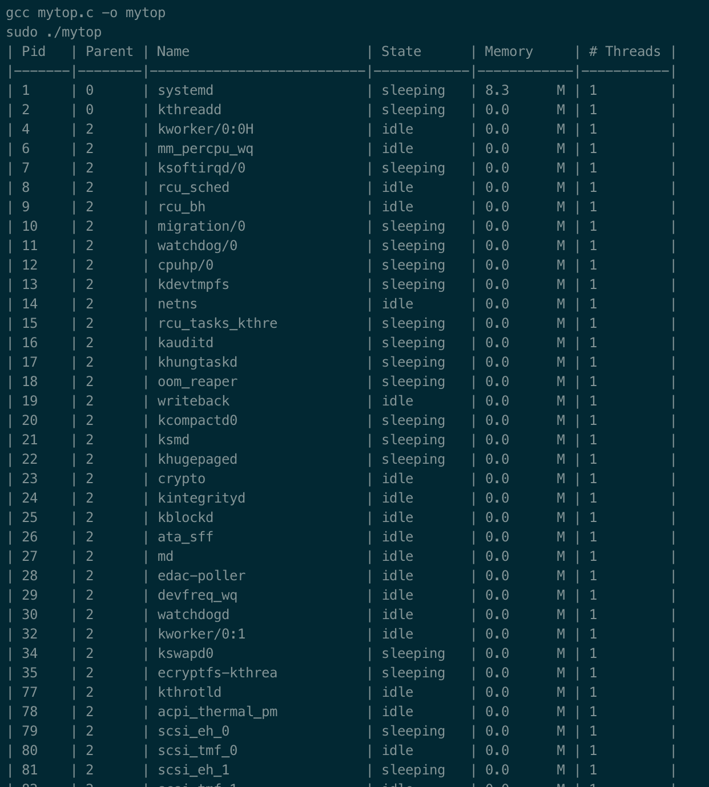
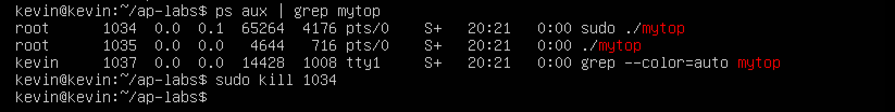

MyTop
=====
Implement a new version of the `top` tool. The only source of information about processes  will be the `/proc` filesystem. This should be a real-time application that automatically updates the dashboard with new and terminated processes. Below more details about the requirements.

Compile
----------
To compile simply run 

````
make
````

maybe it will ask you for your password, this is because it runs as *sudo*

**Manual Compiler**
````
gcc mytop.c -o mytop
sudo ./mytop
````

**Clean**
You can type
````
make clean
````

Running
----------
You will find that you can't quit with a ^C command,



Actually it will save a text file

So what you can do to stop is open a new terminal, and type
`````
ps aux | grep mytop
`````

and then kill the process that you want (in this case 1034)
`````
sudo kill 1034
`````

